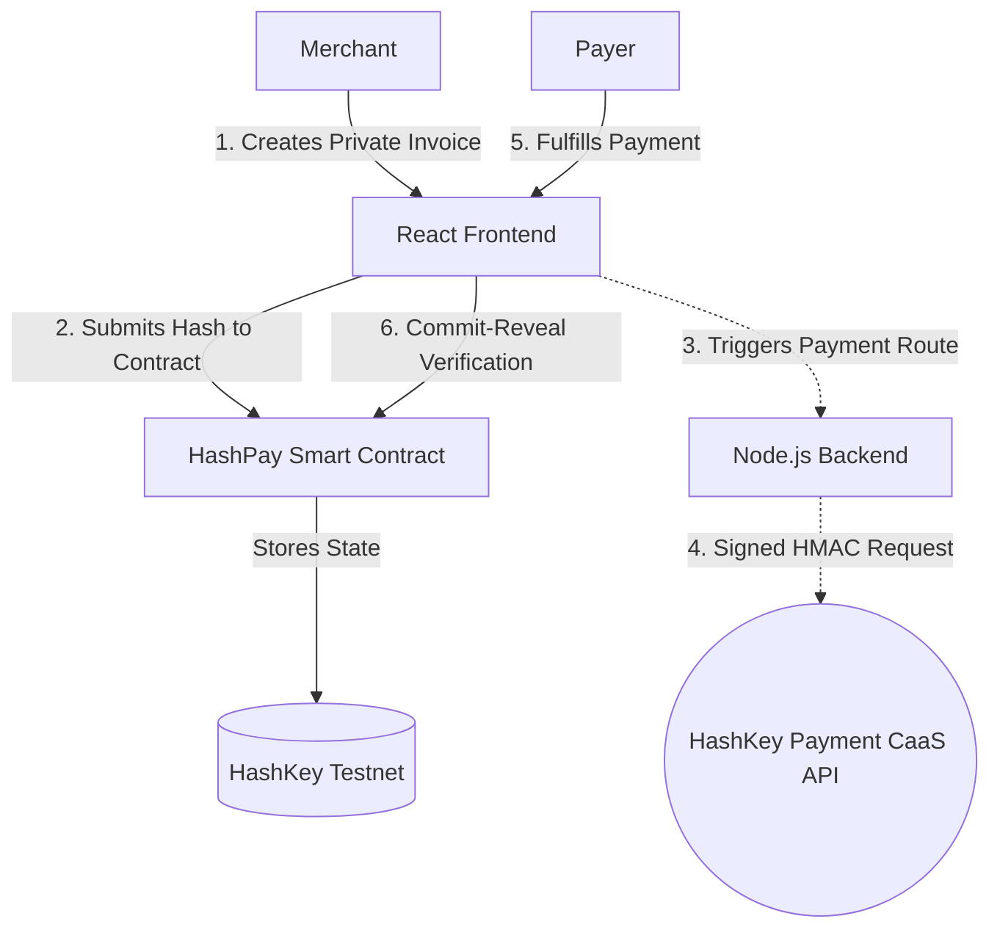

# HashPay HSK — Privacy-First Payments on HashKey Chain

> 🏆 Built for the HashKey Hackathon · **PayFi Track** · Powered by HSP

HashPay HSK is a privacy-first invoice and payment protocol built on **HashKey Chain**. It adapts HashPay's zero-knowledge commit-reveal pattern to EVM, enabling merchants to create private invoices and payers to settle them anonymously — all on-chain.

## 🔑 Core Features

- **🔒 Privacy-First Invoices** — Merchant addresses and amounts are hashed with `keccak256` before storing on-chain
- **⚡ Instant Settlement** — Built on HashKey Chain L2 for sub-second finality
- **💎 Multi-Token** — Accept HSK, USDC, USDT, or any ERC20 token
- **🏦 HSP Payment Channels** — Escrow-based settlement channels for recurring billing
- **📱 QR Code Payments** — Generate shareable payment links and QR codes
- **🧾 Dual Receipts** — Cryptographic receipts for both payer and merchant
- **📊 Merchant Dashboard** — Track invoices, payments, and earnings

## 🏗️ Architecture



### Privacy Model (Commit-Reveal)

1. **Commit**: Merchant creates invoice with `hash = keccak256(merchant + amount + salt + token)`
2. **On-Chain**: Only the hash, token type, and status are stored
3. **Reveal**: Payer provides the preimage (salt, merchant address) to settle
4. **Verify**: Smart contract verifies `computed_hash == stored_hash` before executing payment

## 📁 Project Structure

```
HashPay/
├── contracts/
│   ├── HashPay.sol             # Core invoice/payment protocol
│   ├── HSPSettlement.sol       # PayFi settlement channels
│   └── interfaces/IERC20.sol   # ERC20 interface
├── backend/
│   ├── server.js               # Node.js Express server for CaaS integration
│   ├── package.json            # Backend dependencies
│   └── .env.example            # Backend env vars
├── frontend/
│   └── src/
│       ├── App.jsx             # Main app with routing
│       ├── config/             # Chain & API config
│       ├── hooks/              # Wallet, contract, invoice hooks
│       ├── pages/              # Landing, Create, Pay, Dashboard, Settlement
│       └── components/         # Navbar, InvoiceCard, Toast
├── render.yaml                 # Render.com deployment configuration
└── README.md
```

## 🚀 Quick Start

### Prerequisites
- Node.js v18+
- MetaMask browser extension
- HashKey Chain Testnet HSK ([Faucet](https://docs.hashkeychain.net/docs/Build-on-HashKey-Chain/Tools/Faucet))

### 1. Install Dependencies

```bash
# Root (Hardhat)
npm install

# Frontend
cd frontend && npm install
```

### 2. Compile Smart Contracts

```bash
npx hardhat compile
```

### 3. Deploy to HashKey Testnet

```bash
# Create .env with your private key
echo "PRIVATE_KEY=your_private_key_here" > .env

# Deploy
npx hardhat run scripts/deploy.js --network hashkeyTestnet
```

After deployment, update the contract addresses in `frontend/src/config/contracts.js`.

### 4. Run Locally (Full Stack)

To test the full CaaS integration, run both frontend and backend:

**Terminal 1: Node.js Backend**
```bash
cd backend
npm install
npm run dev
```

**Terminal 2: React Frontend**
```bash
cd frontend
npm run dev
```

Visit `http://localhost:5173`

## 🔧 HashKey Chain Network

| Property | Testnet | Mainnet |
|---|---|---|
| RPC URL | `https://testnet.hsk.xyz` | `https://mainnet.hsk.xyz` |
| Chain ID | 133 | 177 |
| Currency | HSK | HSK |
| Explorer | `testnet-explorer.hsk.xyz` | `hashkey.blockscout.com` |

### MetaMask Setup

The app automatically prompts to add/switch to HashKey Chain when you connect your wallet.

## 📜 Smart Contracts

### HashPay.sol — Core Protocol

| Function | Description |
|---|---|
| `createInvoice()` | Create a private invoice with hashed details |
| `payInvoice()` | Pay by revealing the preimage (commit-reveal) |
| `batchPay()` | Settle multiple invoices in one transaction |
| `cancelInvoice()` | Cancel an open invoice (creator only) |
| `getInvoice()` | Query invoice status and details |
| `getStats()` | Global protocol statistics |

### HSPSettlement.sol — PayFi Settlement

| Function | Description |
|---|---|
| `createChannel()` | Create escrow payment channel |
| `fundChannel()` | Add funds to an existing channel |
| `settleChannel()` | Release funds to payee incrementally |
| `closeChannel()` | Close channel and refund remaining |
| `disputeChannel()` | Raise a dispute for arbitration |

## 🛡️ Security

- **Hash Commitment**: `keccak256(merchant, amount, salt, token)` — 256-bit security
- **Salt Entropy**: 256-bit random values via `crypto.getRandomValues()`
- **Replay Protection**: Receipt tracking prevents duplicate payments
- **Time-Locked Channels**: HSP channels with configurable expiry

## 🏆 Hackathon Track: PayFi

This project aligns with the **PayFi** track:
- **HSP Integration**: Payment channels for recurring billing and streaming payments
- **Settlement Protocol**: On-chain escrow with off-chain settlement signatures
- **Privacy-Preserving**: Commit-reveal scheme for confidential invoices
- **Multi-Token**: Support for HSK and all ERC20 tokens on HashKey Chain

## 🔮 Future Work: Full Sender Anonymity

While the current MVP successfully hides the **recipient (merchant)** and invoice details using a commit-reveal hash pattern, EVM block explorers natively display the `From` address of the transaction initiator who pays the gas fees. 

To achieve **100% sender anonymity** in future versions, HashPay will integrate:
1. **Account Abstraction (ERC-4337) & Relayers**: Users will sign their invoice creation payloads off-chain. A Relayer (Gas Station Network) will submit the transaction to HashKey Chain and pay the gas in HSK. The block explorer will then show the Relayer's address as the `From` address, completely decoupling the creator's wallet from the on-chain execution.
2. **Stealth Addresses (ERC-5564)**: Generating non-linked, ephemeral addresses for each interaction to ensure the payload signer cannot be traced back to their main identity, separating the fund source from the transaction executor.

## 📚 Resources

- [HashKey Chain Docs](https://docs.hashkeychain.net/)
- [HashFans Community](https://hashfans.io/)
- [HashPay Original (Aleo)](https://github.com/geekofdhruv/HashPay)
- [HashKey Token Contracts](https://docs.hashkeychain.net/docs/Build-on-HashKey-Chain/Token-Contracts)

## 📄 License

MIT
